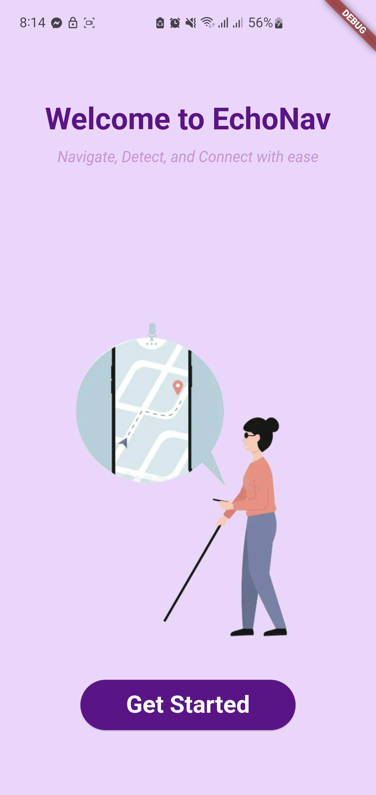
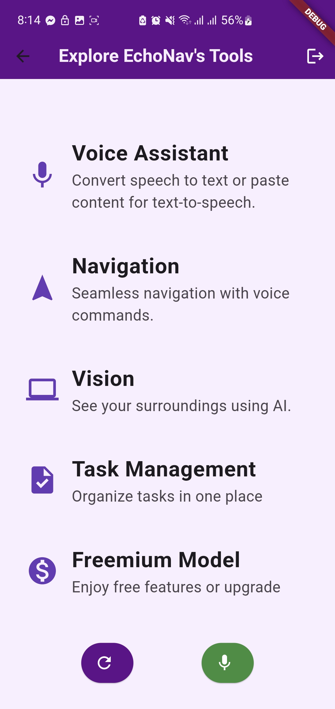
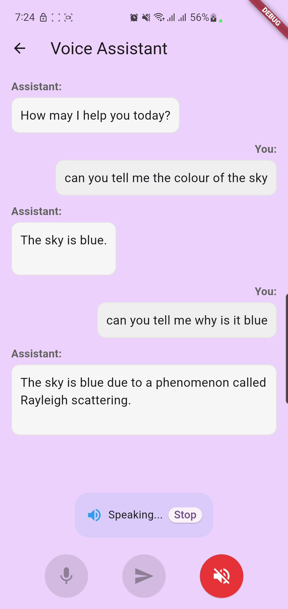
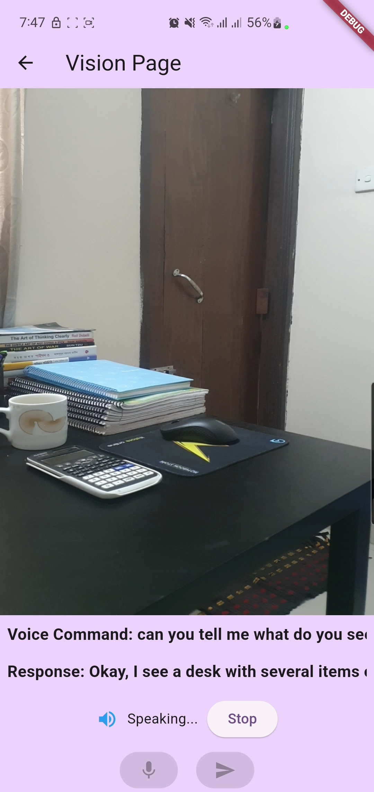

# EchoNav

EchoNav is a mobile application built with Flutter, designed to empower visually impaired individuals by offering accessible tools for daily tasks, navigation, and communication. The app utilizes voice control for hands-free interaction and AI-driven object and speech recognition to provide real-time descriptions of surroundings.


## Key Features

### 1. Face Authentication
- Secure user login using facial recognition
- Flask-based backend for fast and accurate face detection
- Automatic user session management

### 2. Voice-Controlled Interface
- Complete hands-free operation
- Voice feedback for all actions
- Hands-free navigation throughout the app
- Voice command recognition for all app features




### 3. Voice Assistant
- Natural language processing for user commands
- Speech-to-text and text-to-speech capabilities
- Context aware AI conversation assistant 




### 4. Vision Recognition
- Real-time object detection and scene recognition
- Object text recognition and reading, directions to surroundings
- Environment description for visually impaired users
- FastAPI backend for quick processing 
- Support for camera feed



### 5. Navigation Assistance
- Voice-guided navigation
- Integration with Google Maps
- Real-time location tracking
- Accessible route planning and directions
- Audio feedback for navigation cues


### 6. Task Management
- Voice-controlled task creation and management
- Natural language based task overview, add, delete operations
- SQLite database for local storage


### 7. Premium Features (Subscription Plans)

EchoNav offers several subscription plans with enhanced features:

#### Yearly Plan (BEST VALUE)
- ৳600 (33% savings from original ৳900)
- 7 days free trial
- All premium features included

#### 3 Months Plan (MOST POPULAR)
- ৳220 (27% savings from original ৳300)
- 3 days free trial
- All premium features included

#### 1 Month Plan
- ৳80 (20% savings from original ৳100)
- All premium features included


All premium plans include:
- Faster object recognition
- Unlimited prompts
- Priority support
- Advanced navigation features
- Enhanced voice commands
- Premium user support


### Frontend (Flutter)
- Material Design UI
- Responsive layout
- Accessibility features
- Cross-platform compatibility

### Backend Services

#### 1. Facial Recognition Server (Flask)
- User authentication
- Face detection and recognition (Deepface Model)
- Session management
- Runs on port 5000

#### 2. Vision Model Server (FastAPI)
- Object detection and directions system
- Scene recognition
- Navigation assistance using Gemini Flash 2.0
- Task management
- Runs on port 8000
- Implemented with LangChain

### Vision Model Configuration
The backend uses:
- FastAPI for API endpoints
- Gemini Flash 2.0 for vision and language processing
- LangChain for agentic AI pipeline management
- SQLite for task storage
- Base64 encoding for image transfer
- Real-time scene analysis and navigation guidance

### Environment Variables (.env)
The vision model backend requires:
```bash
GOOGLE_API_KEY=your-google-api-key
MODEL_NAME=gemini-2.0-flash
```

### Server Configuration
To run the FastAPI server:
```bash
cd vision_model
python -m venv venv
source venv/bin/activate  # or `venv\Scripts\activate` on Windows
pip install -r requirements.txt
uvicorn main:app --host 0.0.0.0 --port 8000
```

### API Endpoints

#### Face Recognition Configuration
The backend uses:
- Flask for API endpoints
- DeepFace for facial recognition
- OpenCV for image processing
- Base64 encoding for image transfer
- SQLite for user management

### Environment Variables (.env)
The facial recognition backend requires:
```bash
DEEPFACE_MODEL=VGG-Face
FACE_DETECTOR_BACKEND=opencv
```

### Server Configuration
To run the Flask server:
```bash
cd faceRecog_backend
python -m venv venv
source venv/bin/activate  # or `venv\Scripts\activate` on Windows
pip install -r requirements.txt
python app.py
```

### API Endpoints

#### Authentication
- `POST /register`
  - Registers new user with facial data
  - Parameters:
    - `image`: str (Base64) - Facial image for registration
    - `user_id`: str - Unique identifier for the user
  - Returns:
    - Success/failure message
    - User ID if successful

- `POST /login`
  - Authenticates user using facial recognition
  - Parameters:
    - `image`: str (Base64) - Facial image for verification
  - Returns:
    - Authentication status
    - User ID if successful
    - Confidence score

- `GET /verify/{user_id}`
  - Verifies existing user's identity
  - Parameters:
    - `user_id`: str - User identifier
    - `image`: str (Base64) - Facial image for verification
  - Returns:
    - Verification status
    - Confidence score

#### User Management
- `GET /users`
  - Lists all registered users
  - Returns:
    - Array of user IDs and registration dates

- `DELETE /users/{user_id}`
  - Removes user from system
  - Parameters:
    - `user_id`: str - User to delete
  - Returns:
    - Deletion confirmation

### Dependencies
Key dependencies include:
```bash
flask==2.0.1
deepface==0.0.75
opencv-python==4.5.3.56
numpy==1.21.2
pillow==8.3.2
requests==2.26.0
python-dotenv==0.19.0
```


#### Vision and Navigation
- `POST /api/ask`
  - Processes vision and language queries
  - Parameters:
    - `prompt`: str (Form) - User's question
    - `image`: Optional[str] (Form) - Base64 encoded image
  - Returns:
    - AI-generated response describing the scene/objects

- `POST /api/ask/map`
  - Similar to /api/ask but specialized for map navigation
  - Parameters same as /api/ask

- `POST /api/ask/voice`
  - Handles voice-only queries without images
  - Parameters:
    - `prompt`: str (Form) - User's voice query

#### Task Management
- `POST /api/login`
  - Authenticates user and initializes task management
  - Parameters:
    - `user_id`: str (Form) - User identifier

- `GET /api/tasks`
  - Retrieves all tasks for current user
  - Returns list of tasks with IDs and titles

- `POST /api/tasks/add`
  - Creates new task
  - Parameters:
    - `task_title`: str (Form) - Task description

- `DELETE /api/tasks/{task_id}`
  - Removes specific task
  - Parameters:
    - `task_id`: int - Task identifier

- `POST /api/tasks/command`
  - Natural language task management
  - Parameters:
    - `command`: str (Form) - Voice command for task operations
  - Supports: add, delete, list operations

### Dependencies
Key dependencies include:
- fastapi
- uvicorn
- python-multipart
- python-dotenv
- google-generativeai
- langchain
- langchain_google_genai
- sqlite3
- pydantic
- logging


## Prerequisites

Before running the application, ensure you have the following installed:

- [Flutter SDK](https://flutter.dev/docs/get-started/install) (2.0.0 or higher)
- [Dart SDK](https://dart.dev/get-dart) (2.12.0 or higher)
- [Android Studio](https://developer.android.com/studio) or [VS Code](https://code.visualstudio.com/)
- [Python](https://www.python.org/downloads/) (3.7+ for backends)
- [pip](https://pip.pypa.io/en/stable/installation/)

## Installation and Setup

### 1. Flutter Frontend
```bash
git clone https://github.com/yourusername/echonav.git
cd echonav
flutter pub get
```

### 2. Facial Recognition Backend (Flask)
```bash
cd facial_recognition_backend
python -m venv venv
source venv/bin/activate  # or `venv\Scripts\activate` on Windows
pip install flask opencv-python face_recognition dlib numpy
python app.py
```

### 3. Vision Model Backend (FastAPI)
```bash
cd vision_model
python -m venv venv
source venv/bin/activate  # or `venv\Scripts\activate` on Windows
pip install -r requirements.txt
python main.py
```

